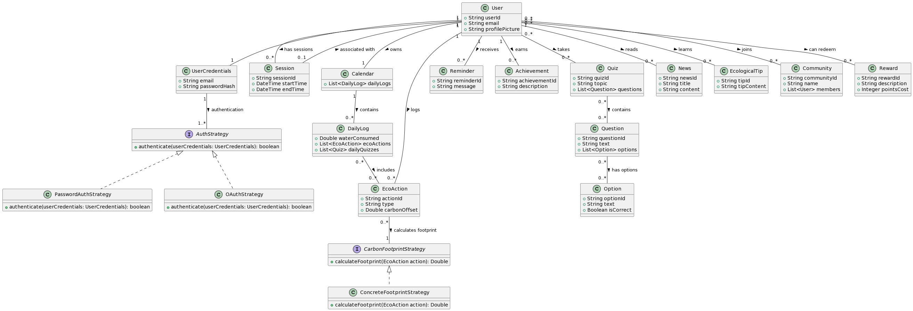
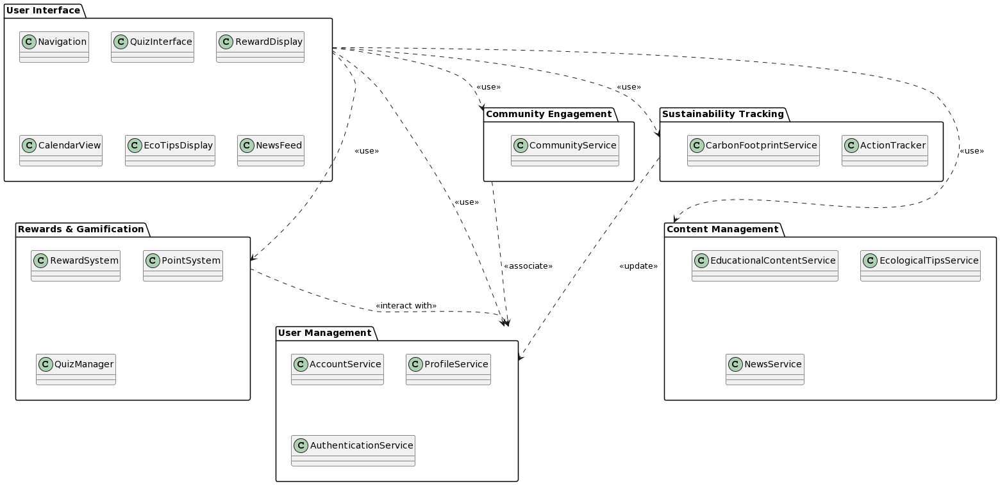
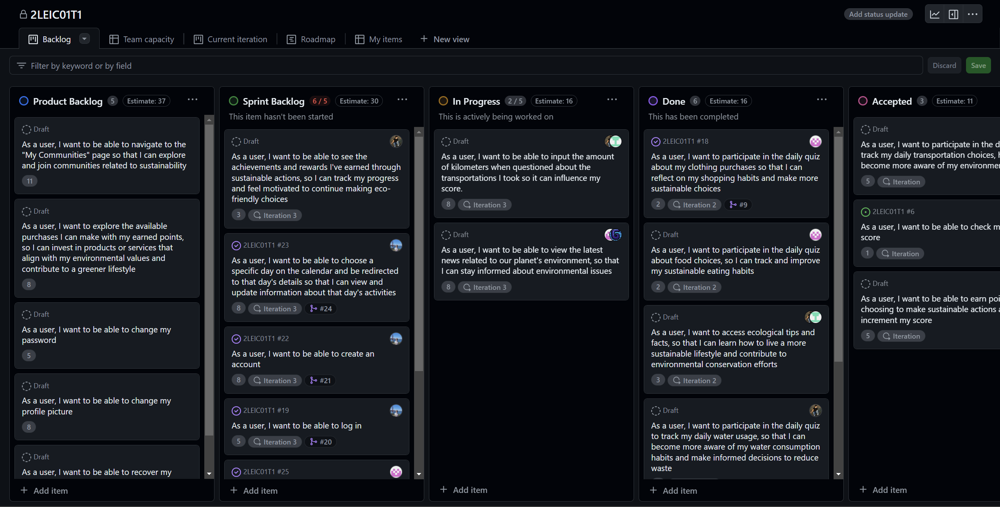
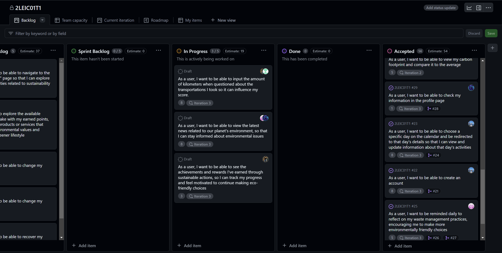

# ECOAct Development Report

Welcome to the documentation pages of ECOAct!

You can find here details about the ECOAct, from a high-level vision to low-level implementation decisions, a kind of Software Development Report, organized by type of activities:

- [Business modeling](#Business-Modelling)
  - [Product Vision](#Product-Vision)
- [Requirements](#Requirements)
  - [User stories](#User-stories)
  - [Domain model](#Domain-model)
- [Architecture and Design](#Architecture-And-Design)
  - [Vertical prototype](#Vertical-Prototype)
- [Tests](#Tests)
- [Screenshoots of the beginig and end of sprint](#Screenshoots-of-the-beginig-and-end-of-sprint)
- [Sprint Retrospective and Feedback](#Sprint-Retrospective)

Contributions are expected to be made exclusively by the initial team, but we may open them to the community, after the course, in all areas and topics: requirements, technologies, development, experimentation, testing, etc.

Please contact us!

Thank you!

- Bartek Pacia (up202311689@up.pt)
- Dinis Galvão (up202207217@up.pt)
- Joana Pimenta (up202206120@up.pt)
- Luna Cunha (up202205714@up.pt)
- Rodrigo Araújo (up202205515@up.pt)

---

## Business Modelling

### Product Vision

The ECOAct app aims to create an eco-friendlier environment by making ecological habits more fun and rewarding. By using the app, people will become more aware of their day-to-day habits and how they impact the world and keep track of their carbon footprint.
This app is designed to be very intuitive and easy to use, so it can be used by everyone, especially by those who are looking to make this world greener every day.
Our planet suffers everyday due to our bad habits and sometimes it seems that we alone won’t make a difference, but the ECOAct app is looking to show you otherwise by making a balance of all our users ECOActions, so now you will be able to see that all of us can change the world for better, including you.

## Requirements

### User stories

The user stories are created as GitHub items in the Project board.

### Domain model

### Package UML

## Tests
The tests that were implemented can be found in folders [mobile/.maestro](mobile/.maestro) and [mobile/test](mobile/test)

## Screenshoots of the beginig and end of sprint

### Begining Sprint 3
(we forgot to take the screenshoot so we put everything in it's original place but some of the user stories were already complete, and others that were from the previous sprint that stayed In Progress had already iteration and complexity incremented since they were harder than we thought(complexity incrementation) and we worked on them in this sprint(iteration incrementation))

### End Sprint 3
3 stories stayed in progress because we couldn't have the features working in a way that we could consider them finished and presentable in time, for example the news feature.

## Sprint Retrospective

### Sprint 2
In this sprint we added more work then the previous sprints, and even though we weren't able to complete everything as we would like to, we still got more work done. Putting more user stories in our sprint backlog made us work more and faster, so now we can have a better idea of the ideal amount of work we should do. We also realised that we have to pay more attention to the details in our work to make sure it's well polished before assuming it as finished. We have started to approach the implementation of unit and acceptance tests, and we are hoping in this next sprint to implement them in the user stories that we already done until this point. We are looking to focus on quality over quantity on the next sprint, since we realized that it's better to have fewer user stories completely done and ready to present, than to have more user stories but them having problems or not being good enough to present.

### Feedback between sprints
- Pay more attention to detail
- Quality over quantity
- more tests
- be more careful to open issues and branchs or pull requests and associate them with the user storie it's about

### Sprint 3
In this sprint we weren't able to complete everything as we would like to. There were user stories in which we underestimated their complexety and for that reason we didn't manage the time to get them done in the way we wanted to and we couldn't achive the quality we wanted to in some features we added last. Next time we should have paid more atention to possible problems we could encounter in each user storie so that it's complexity would be the most accurate possible. We have done more tests them last time. Since our backlog was ordered in a way that made us do the most important features early on, our final product can still pass the main ideias of the app we planned.

### Feedback between sprints
-Try to view every sprint end as a "if we released this app right now in the appstore would it be functional and useful"

